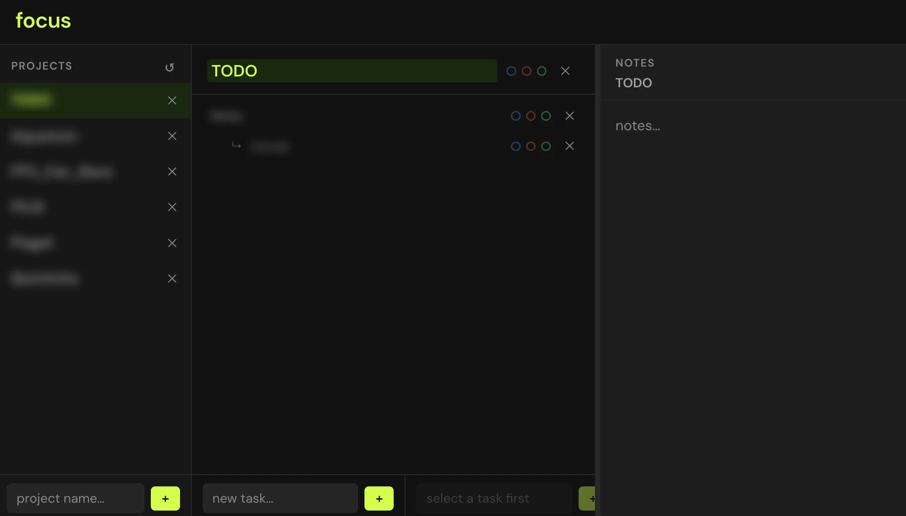

# focus

Simple Clean Minimal Self-Hosted Task Manager



## Stack

- Node.js + Express (API + static server)
- Vanilla JS/CSS, single `index.html`, no build step
- Data stored as `projects/<name>/data.json`

## Run

```bash
npm install
npm start   # http://localhost:5000
```

## Service (Raspberry Pi)

```bash
sudo cp focus.service /etc/systemd/system/
sudo systemctl daemon-reload
sudo systemctl enable focus
sudo systemctl start focus
```

## Features

- Projects, tasks, subtasks with status toggles (brainstorm / developing / released)
- Notes per project / task / subtask, auto-saved
- Drag to reorder projects, tasks, subtasks
- Resizable panels
- Mobile responsive
